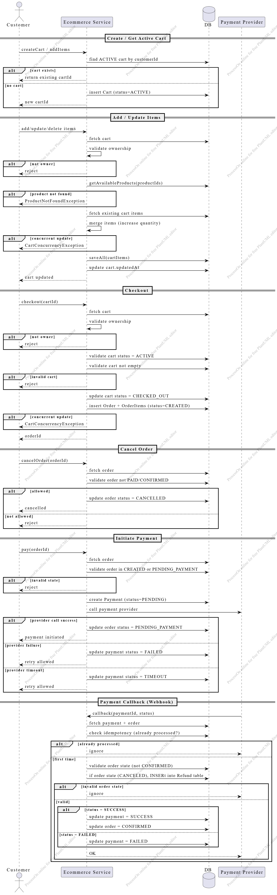
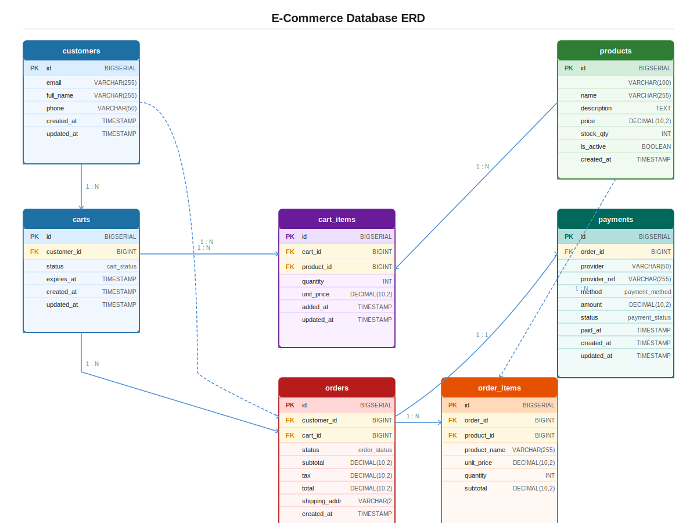

# 🛒 E-Commerce Backend (Spring Boot)

## 📌 Overview

This project implements a simplified **e-commerce backend system** that supports:

* Cart management (create, update, remove items)
* Checkout flow (cart → order)
* Order lifecycle (creation, cancellation)
* Payment processing (with retry, timeout, and callback handling)

The system is designed with a focus on **data consistency, concurrency handling, and real-world payment scenarios**.

---

## 🏗️ Architecture

### Tech Stack

* Java 17
* Spring Boot
* Spring Data JPA
* Gradle
* PostgreSQL
* REST APIs

### Design Style

* Layered architecture:

  ```
  Controller → Service → Repository → Database
  ```
* Transactional boundaries at service layer

### Key Design Principles

* **Optimistic Locking** for concurrency control
* **Idempotency** for payment callbacks
* **Domain validation** at service layer
* **Retry-safe payment flow**

## 📊 Sequence Diagram

### 🔄 State Machine

### 🗄️ Data Model


---

## 🔄 Business Flow

### 1. Cart Flow

1. Customer creates cart or adds items
2. System:

    * Reuses existing ACTIVE cart if present
    * Otherwise creates a new cart
3. Customer can:

    * Add items
    * Update quantities (merge logic)
    * Remove items

### 2. Checkout Flow

1. Customer checks out cart
2. Validations:

    * Cart must be **ACTIVE**
    * Cart must not be empty
3. System:

    * Marks cart as `CHECKED_OUT`
    * Creates Order + OrderItems
    * Sets order status to `CREATED`

### 3. Payment Flow

1. Customer initiates payment
2. System:

    * Creates Payment record (`PENDING`)
    * Calls payment provider
3. Outcomes:

    * **Success call** → Order = `PENDING_PAYMENT`
    * **Failure** → Payment = `FAILED` (retry allowed)
    * **Timeout** → Payment = `TIMEOUT` (retry allowed, but we will inform the customer to contact support). If the payment became success, and customer cancel the order, we will insert into refund (will be handled in the future)

### 4. Payment Callback

1. Provider sends webhook
2. System:

    * Validates order state
    * Checks idempotency (avoid duplicate processing)
3. Outcomes:

    * **SUCCESS** → Payment = `SUCCESS`, Order = `CONFIRMED`
    * **FAILED** → Payment = `FAILED`, Order unchanged

---

## ⚙️ Prerequisites

* Java 17+
* Gradle 1.1.7
* Docker (optional)
* Docker (to create the Postgres DB)

---

## 🚀 How to Run

### Option 1: Run with Docker Compose

```bash
docker-compose up --build
```

This will start:

* Application
* Database
* PgAdmin: You can view the Database table from PgAdmin client, it will be accessible at `localhost:50550` with username `admin@example.com` and password `admin`.


---
## 📡 API Endpoints

### Cart APIs

| Method | Endpoint                           | Description |
| ------ | ---------------------------------- | ----------- |
| POST   | `/v1/carts`                        | Create cart |
| POST   | `/v1/carts/{id}/items`             | Add items   |
| GET    | `/v1/carts/{id}`                   | View cart   |
| DELETE | `/v1/carts/{id}/items/{productId}` | Remove item |
| POST   | `/v1/carts/{id}/checkout`          | Checkout    |

### Order APIs

| Method | Endpoint                         | Description  |
| ------ |----------------------------------| ------------ |
| POST   | `/v1/orders/{id}/cancel`         | Cancel order |


### Payment APIs

| Method | Endpoint                        | Description      |
| ------ |---------------------------------| ---------------- |
| POST   | `/v1/orders/{id}/payment/start` | Initiate payment |
| POST   | `/v1/payments/callback`         | Payment webhook  |

---

## 🔐 Validation & Business Rules

* Only one **ACTIVE cart per customer**
* Cart must belong to the requesting user (ownership validation)
* Cart must be ACTIVE to checkout
* Cart must not be empty
* Order cannot be cancelled if already CONFIRMED
* Payment callbacks are **idempotent**
* Multiple payment attempts are supported (retry model)

---

## ⚠️ Error Handling

The system handles:

* `CartNotFoundException`
* `ProductNotFoundException`
* `CartConcurrencyException` (optimistic locking)
* `CartNotActiveException`
* `CartEmptyException`

---

## 🧠 Design Decisions

### 1. Optimistic Locking

Used to handle concurrent cart updates safely without blocking.

### 2. Idempotent Payment Callback

Prevents duplicate updates from payment provider retries.

### 3. Bulk Product Fetching

All products are fetched in a single query to minimize database calls during cart updates.

### 4. Merge Strategy for Cart Items

Adding the same product increases quantity instead of overwriting.

### 5. Retryable Payment Flow

Failed or timeout payments do not corrupt order state.

---

## ⚠️ Assumptions & Limitations

* Payment provider is mocked/simulated
* No authentication/authorization layer implemented
* Single service (no microservices orchestration)

---

## 🚧 Future Improvements
* Include the Refund flow
* Introduce Kafka for event-driven architecture
* Implement Saga pattern for order-payment coordination
* Add Redis caching
* Add authentication & authorization (JWT)
* Add monitoring (Prometheus + Grafana)
* Improve API documentation (Swagger/OpenAPI)

---

## 📂 Project Structure

```
controller/     → REST endpoints
service/        → Business logic
repository/     → Data access layer
entity/         → JPA entities
dto/            → API models
exception/      → Custom exceptions
```

---

